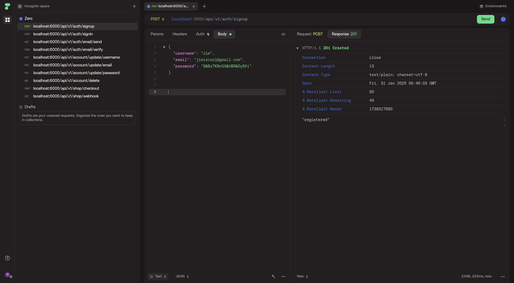
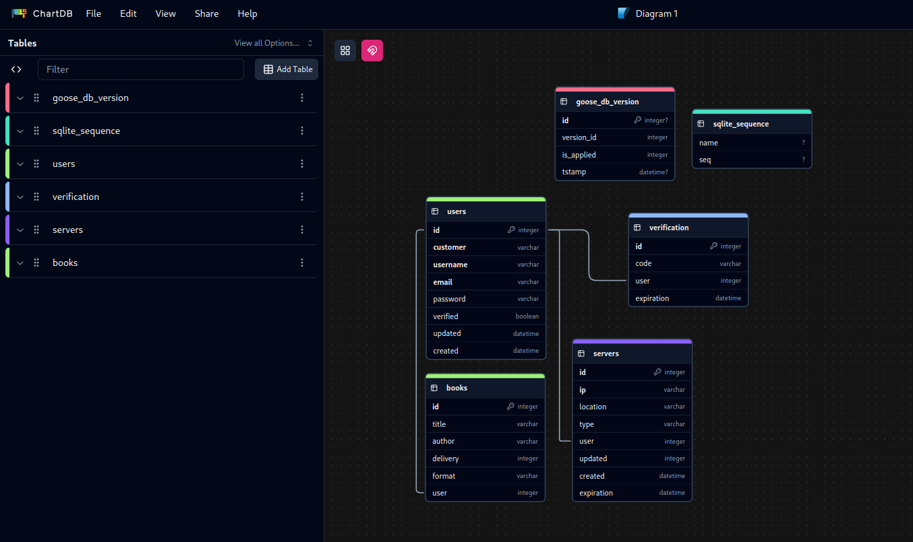

# Zero
A single executable API handling authentication including email verification, payments and more
> This repo contains a stripped version of Zero which is public and not production ready

Similar in size and not handling payments I recommend [PocketBase](https://pocketbase.io)

Found any bad practices or vulnerabilities? Send a PR or contact me!

## How to use an API?
You can send a request to it with any http client including
* CLI clients such as Curl and HTTPie's http and https
* GUI clients such as VSCode's Thunder, Postman, Insomnia and Httpie
* Almost every programming language such as C, Go, Python, Javascript and Lua
* Your favorite browser such as Chrome, Brave, OperaGX and Firefox
Here is how you do it with Curl
```bash
FORMAT
curl -X [method] \
	 -H 'Content-Type: application/json' \
	 -d '{ "key":"value" ... }'
	 https://api.[domain.extension]/[version]/[endpoint]
```



## Prerequisites
**Knowing Go** as you need to change the source code and recompile to use plugins or disable payments

**An SMTP server** such as one from Amazon SES to send email verifcation codes

Possibly **a Stripe account** with a webhook ready to be used to handle payments

Put it all in your .env(a .env.example is available)

## Installation
* Download a release
* Compile from source
```sh
git clone https://github.com/0xalby/zero
cd zero
go mod tidy
make build
```
* Using Docker
```sh
docker build -t zero:v1 .
```
```sh
docker run --env-file ./.env -p 6000:6000 -d zero
```
The port will depend on the content of .env change it accordingly

## Simple reference
There are three main route groups which are /auth, /account and /shop and they do what you would expect
### Authentication /auth
```
POST /auth/signup requires username, email and password
POST /auth/signin requires email and password
GET /auth/email/send requires email
POST /auth/email requires email and code(as in verification code)
PUT /account/update/username requires new and old
PUT /account/update/email requires new and old
PUT /account/update/password requires password(the new one)
DELETE /account/update/delete requires password(security confirmation)
POST /shop/checkout requires product(the name) and quantity(no decimals)
```
### Schema

You can see two example migrations(part of a plugin) for a deployment and a book shop 

Use "zero/utils" if you are making a plugin that uses an external API to not reuse code as it already has a wrapper for making HTTP requests.

Custom logger output is available in app.log

## Plugins
I probably won't be adding them, but who knows?

## Reasoning
This is good a good code sample for people to review and help me improve!
